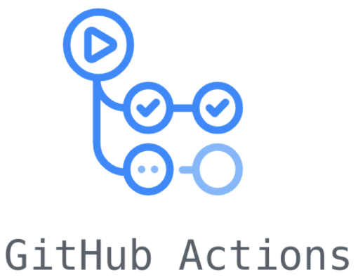
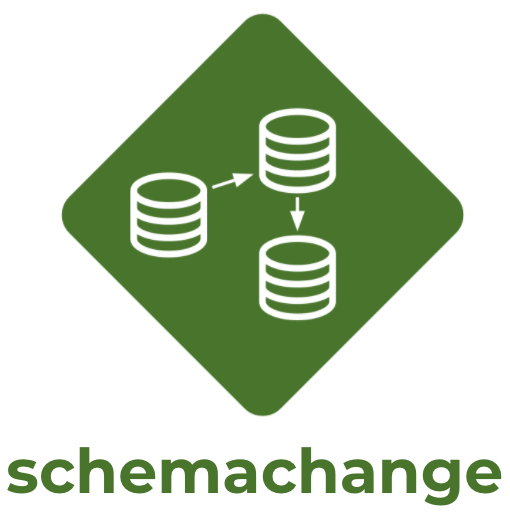

# Infrastructure - DevOps : Github X Schemachange
<!-- ------------------------ -->
## Apercu


Ce guide se concentrera principalement sur la gestion automatisée des versions pour Snowflake en tirant parti du service GitHub Actions de GitHub.De plus, afin de gérer les objets de base de données / modifications dans Snowflake, je vais utiliser l'outil Schemachange Database Change Management (DCM).


### Apprentissage

* Un apercu des GitHub actions
* Un aperçu de Schemachange
* Comment les outils de gestion du changement de base de données comme Schemachange foctionnent
* Comment créer des pipelines CI / CD dans les GitHub actions

### Ce dont vous aurez besoin

1. Snowflake
  1. **A Snowflake Account.**
  2. **A Snowflake Database named DEMO_DB.**
  3. **A Snowflake User created with appropriate permissions.** Cet utilisateur aura besoin d'autorisation pour créer des objets dans la base de données Demo_DB.
2. GitHub
  1. **A GitHub Account.** 
  2. **A GitHub Repository.** 
3. Integrated Development Environment (IDE)
  1. **Your favorite IDE with Git integration.** 
  2. **Votre repo de projet s'est cloné vers votre ordinateur.**

### Ce que vous allez construire

* Un pipeline simple de  CI/CD DCM pour Snowflake en utilisant SCHEMACHANGE et GitHub Actions

<!-- ------------------------ -->
## Apercu GitHub 


### GitHub

- Codage collaboratif
- Automatisation et CI / CD
- Sécurité
- Gestion de projet
- Administration d'équipe
- Communauté



### GitHub Actions


**Ce guide sera axé sur le service GitHub Actions**

<!-- ------------------------ -->
## schemachange Overview




Schemachange est un outil léger basé sur Python pour gérer tous vos objets de flocon de neige.Il suit une approche de style impératif de la gestion du changement de base de données (DCM).Lorsque Schemachange est combiné avec un outil de contrôle de version et un outil CI / CD, les modifications de la base de données peuvent être approuvées et déployées via un pipeline à l'aide de pratiques de LIVRAISON de Software.

For more information about schemachange please see [the schemachange project page](https://github.com/Snowflake-Labs/schemachange).


<!-- ------------------------ -->
## Create Your First Database Migration

Ouvrez votre référentiel cloné dans votre IDE préféré et créez un dossier nommé «Migrations».Dans ce nouveau dossier, créez un script nommé `v1.1.1__initial_objects.sql` (assurez-vous qu'il y a deux soulignements après le numéro de version) avec le contenu suivant:

```sql
CREATE SCHEMA DEMO;
CREATE TABLE HELLO_WORLD
(
   FIRST_NAME VARCHAR
  ,LAST_NAME VARCHAR
);
```

Ensuite, COMMIT le nouveau script et appuyez sur les modifications dans votre référentiel GitHub.En supposant que vous ayez commencé à partir d'un référentiel vide, votre référentiel devrait ressembler à ceci:


<!-- ------------------------ -->
## Create Action Secrets

Les secrets d'action dans GitHub sont utilisés pour stocker en toute sécurité les valeurs / variables qui seront utilisées dans vos pipelines CI / CD.Dans cette étape, nous créerons des secrets pour chacun des paramètres utilisés par Schemachange.


<table>
    <thead>
        <tr>
            <th>Secret name</th>
            <th>Secret value</th>
        </tr>
    </thead>
    <tbody>
        <tr>
            <td>SF_ACCOUNT</td>
            <td>xy12345.east-us-2.azure</td>
        </tr>
        <tr>
            <td>SF_USERNAME</td>
            <td>DEMO_USER</td>
        </tr>
        <tr>
            <td>SF_PASSWORD</td>
            <td>*****</td>
        </tr>
        <tr>
            <td>SF_ROLE</td>
            <td>DEMO_ROLE</td>
        </tr>
        <tr>
            <td>SF_WAREHOUSE</td>
            <td>DEMO_WH</td>
        </tr>
        <tr>
            <td>SF_DATABASE</td>
            <td>DEMO_DB</td>
        </tr>
    </tbody>
</table>


Lorsque vous avez fini d'ajouter tous les secrets, la page devrait ressembler à ceci:


<!-- ------------------------ -->
## Create an Actions Workflow

Les workflows d'action représentent des pipelines automatisés, ce qui inclut à la fois des pipelines de construction et de libération.Ils sont définis comme des fichiers YAML et stockés dans votre référentiel dans un répertoire appelé `.github / workflows`.Dans cette étape, nous créerons un flux de travail de déploiement qui exécutera Schemachange et déploierons les modifications de notre base de données Snowflake.


- From the repository, click on the `Actions` tab near the top middle of the page.
- Click on the `set up a workflow yourself ->` link (if you already have a workflow defined click on the `new workflow` button and then the `set up a workflow yourself ->` link)
- On the new workflow page
  - Name the workflow `snowflake-devops-demo.yml`
  - In the `Edit new file` box, replace the contents with the the following:

```yaml  
name: snowflake-devops-demo

# Controls when the action will run. 
on:
  push:
    branches:
      - main
    paths:
      - 'migrations/**'

  # Allows you to run this workflow manually from the Actions tab
  workflow_dispatch:

jobs:
  deploy-snowflake-changes-job:
    runs-on: ubuntu-latest

    steps:
      # Checks-out your repository under $GITHUB_WORKSPACE, so your job can access it
      - name: Checkout repository
        uses: actions/checkout@v2

      - name: Use Python 3.8.x
        uses: actions/setup-python@v2.2.1
        with:
          python-version: 3.8.x

      - name: Run schemachange
        env:
          SF_ACCOUNT: ${{ secrets.SF_ACCOUNT }}
          SF_USERNAME: ${{ secrets.SF_USERNAME }}
          SF_ROLE: ${{ secrets.SF_ROLE }}
          SF_WAREHOUSE: ${{ secrets.SF_WAREHOUSE }}
          SF_DATABASE: ${{ secrets.SF_DATABASE }}
          SNOWFLAKE_PASSWORD: ${{ secrets.SF_PASSWORD }}
        run: |
          echo "GITHUB_WORKSPACE: $GITHUB_WORKSPACE"
          python --version
          echo "Step 1: Installing schemachange"
          pip install schemachange
          
          echo "Step 2: Running schemachange"
          schemachange -f $GITHUB_WORKSPACE/migrations -a $SF_ACCOUNT -u $SF_USERNAME -r $SF_ROLE -w $SF_WAREHOUSE -d $SF_DATABASE -c $SF_DATABASE.SCHEMACHANGE.CHANGE_HISTORY --create-change-history-table
```

Quelques choses à souligner de la définition du pipeline YAML:

- La définition `ON:` configure le pipeline pour s'exécuter automatiquement lorsqu'un changement est commis n'importe où dans le dossier «Migrations» sur la branche «Main» du référentiel.Ainsi, tout changement commis en dehors de ce dossier ou dans une succursale différente ne déclenchera pas automatiquement le flux de travail pour s'exécuter.
- Veuillez noter que si vous réutilisez un référentiel GitHub existant, il pourrait conserver l'ancienne dénomination de la branche «maître».Si oui, veuillez mettre à jour le YAML ci-dessus (voir la section `ON:`).
- Nous utilisons l'agent Linux hébergé par GitHub par défaut pour exécuter le pipeline.
- La section «Env» de l'étape `Run Schemachange` nous permet de définir des variables d'environnement qui seront disponibles pour le script bash.En particulier, cela nous permet de passer en toute sécurité des valeurs secrètes (comme le mot de passe de SNOW) aux applications / scripts exécutant dans le flux de travail comme Schemachange.

<!-- ------------------------ -->
## Exécuter manuellement le Workflow

Dans cette étape, nous exécuterons manuellement le flux de travail des nouveaux actions pour la première fois.Cela déploiera le premier script de migration de base de données que nous avons créé à l'étape 4.


Pour afficher les détails d'une exécution, cliquez sur le nom de l'exécution spécifique (vous devrez peut-être actualiser la page  `Deploy-Snowflake-Changes-Job`, puis parcourez la sortie à partir des différentes étapes.En particulier, vous voudrez peut-être passer en revue la sortie de l'étape «Exécuter Schemachange».


<!-- ------------------------ -->
## Confirmer les modifications déployées dans Snowflake

Maintenant que votre première migration de base de données a été déployée sur Snowflake, connectez-vous à votre compte Snowflake et confirmez.
### Database Objects

Vous devriez maintenant voir quelques nouveaux objets dans votre base de données `Demo_DB`:

- Un nouveau schéma `démo` et table` hello_world` (créé par le premier script de migration à partir de l'étape 4)
- Un nouveau schéma «Schemachange» et le tableau `Change_History` (créé par Schemachange pour suivre les modifications déployées)


<!-- ------------------------ -->
## Créez votre deuxième migration de base de données

Dans ce script, vous créera votre deuxième migration de base de données et que les actions GitHub le déploient automatiquement sur votre compte SnowFlake (pas besoin d'exécuter manuellement le workflow cette fois)!

Ouvrez votre référentiel cloné dans votre IDE préféré et créez un script nommé `v1.1.2__updated_objects.sql` (assurez-vous qu'il y a deux soulignements après le numéro de version) dans le même dossier` Migrations` avec le contenu suivant:

```sql
USE SCHEMA DEMO;
ALTER TABLE HELLO_WORLD ADD COLUMN AGE NUMBER;
```

Ensuite, engagez le nouveau script et appuyez sur les modifications dans votre référentiel GitHub.En raison du déclencheur d'intégration continue que nous avons créé dans la définition YAML, votre flux de travail aurait dû avoir automatiquement démarré une nouvelle exécution.Ouvrez le workflow, cliquez sur la dernière exécution, puis cliquez sur le travail `Deploy-Snowflake-Changes-Job` et parcourez la sortie à partir des différentes étapes.En particulier, vous voudrez peut-être passer en revue la sortie de l'étape `Run Schemachange`.

<!-- ------------------------ -->
## Conclusion & Next Steps

### Ce que nous avons couvert

* Un bref historique et un aperçu des actions GitHub
* Une brève histoire et un aperçu de Schemachange
* Comment les outils de gestion du changement de base de données comme Schemachange Work
* Comment fonctionne un pipeline de libération simple
* Comment créer des pipelines CI / CD dans les actions GitHub

### Ressources connexes

* [schemachange](https://github.com/Snowflake-Labs/schemachange)
* [GitHub Actions](https://github.com/features/actions)


## Authors

* M'hamed Issam ED-DAOU
* Yassine DEHBI
